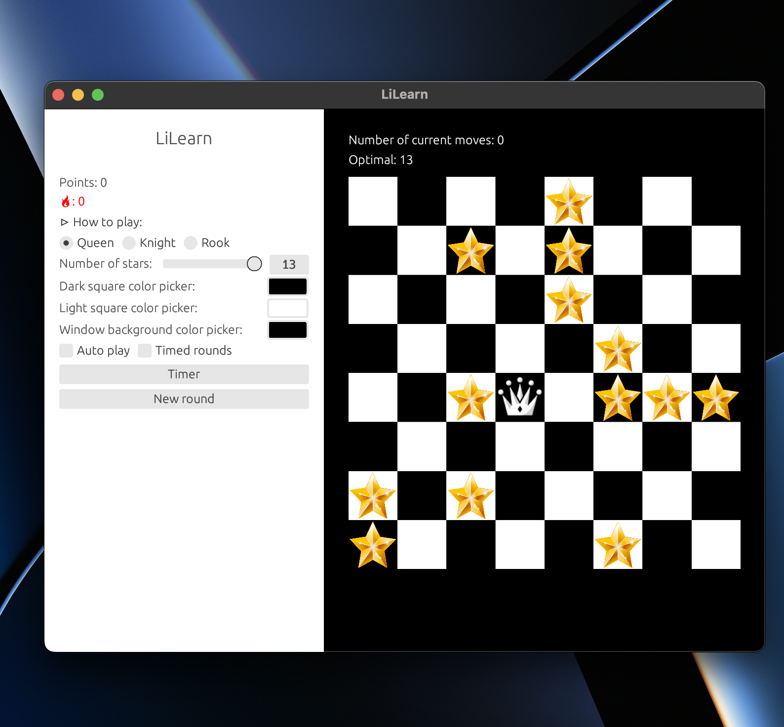

# LiLearn v2



Try the [web version](https://arshiyasolei.github.io/lilearn2/) or get the [binaries!](https://github.com/arshiyasolei/lilearn2/releases) 

requires a [rust installation.](https://www.rust-lang.org/tools/install) 

to run from source:
```
cargo run
```

for web: (using WSL or any *nix)
```
cargo install trunk
trunk serve
```